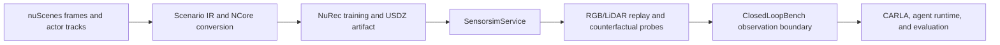

# Reconstruction And Downstream Simulation Handoff

Status: open-loop renderer delivery, validated against `ClosedLoopBench/main`
at `b17f863` on 2026-08-06.

## Purpose

`NeuralSceneBridge` turns a recorded sensor sequence and its actor tracks into a
versioned NuRec reconstruction artifact. The artifact is served through NVIDIA
`SensorsimService` so a downstream simulator or perception runtime can request
RGB and LiDAR observations at a known logical time and with controlled actor or
camera edits.

The current scene-0061 delivery is a reconstruction and renderer handoff. It is
not a closed-loop driving result: the input trajectory is fixed, and this
repository does not own CARLA's synchronous clock, ego control, collision
state, or evaluation feedback.

## Data Flow

`NeuralSceneBridge` owns A-E. `ClosedLoopBench` owns F-G. The handoff between
them is the artifact identity, sensor contract, timestamp/window semantics,
coordinate frame, actor pose binding, and per-frame payload hash.

## Current Scene-0061 Boundary

| Capability | State | Meaning |
| --- | --- | --- |
| Canonical USDZ and checkpoint identity | Ready | Artifact hash and runtime identity are pinned. |
| Dynamic actor inventory | Ready | 223 tracks are embedded; the target track is controllable. |
| RGB replay and actor edit | Ready | V01/V02 show reproducible replay and RGB response to a target pose edit. |
| Camera pose control | Ready | V03 proves bounded extrinsic edits reach the RPC request. |
| Renderer-level RGB/LiDAR capture | Ready | V04 captures both responses in the same logical windows. |
| Physical RGB/LiDAR world consistency | Blocked | The reconstructed LiDAR is not yet actor- or world-consistent. |
| Perception-grade reconstructed LiDAR | Blocked | ClosedLoopBench M8 scoring collapses on the NRE LiDAR input. |
| CARLA closed loop | Not in this repository | It remains a downstream integration owned by ClosedLoopBench. |

`status: passed` in a V04 evidence file means that the capture completed and
the payload contract was valid. It does not mean that RGB and LiDAR are
physically aligned or that LiDAR returns have actor ownership labels.

## LiDAR Finding

The latest `ClosedLoopBench` investigation isolates the failure to the NuRec
26.04 dynamic LiDAR rendering path:

- `NRE RGB + raw LiDAR` restores detection (`mAP50` about `0.130`), while
  `raw RGB + NRE LiDAR` remains at `0` matches and `mAP50 = 0`.
- Target-only, empty, and all-minus-target renders have essentially the same
  returns near the true target ROI.
- Target poses at `34.7 m` and `100 m` produce the same `136` extra cells.
- A vehicle rendered alone produces a fixed scatter about `12 m` forward,
  rather than returns at its requested pose.

The working diagnosis is that the server-side dynamic LiDAR path does not
apply each track's cuboid pose before raycasting the dynamic Gaussian layer.
The observed points are consistent with a canonical position plus
`lidar_extra_signal`, rather than a correctly transformed per-track object.
This is an upstream/runtime limitation or a checkpoint/runtime convention
mismatch under investigation, not a downstream coordinate patch that this
repository can truthfully claim to have fixed.

The full evidence is maintained in
[`ClosedLoopBench/docs/open_loop_m8_debug_log.md`](https://github.com/cola1917/ClosedLoopBench/blob/main/docs/open_loop_m8_debug_log.md)
and the forum-ready report in
[`ClosedLoopBench/docs/nurec_lidar_dynamic_bug_report.md`](https://github.com/cola1917/ClosedLoopBench/blob/main/docs/nurec_lidar_dynamic_bug_report.md).

## Integration Rules

1. Use the NuRec RGB route for renderer replay, actor edits, and visual
   observation experiments.
2. Treat reconstructed LiDAR as diagnostic until a new artifact and live
   server probe pass same-frame actor-aware geometry checks.
3. Keep raw CARLA LiDAR and reconstructed NuRec LiDAR as separate provenance
   routes. A mixed-modality experiment is useful for attribution, but it is not
   a replacement for a coherent downstream sensor stream.
4. Pair RGB and LiDAR by logical render window. RGB is sampled at the window
   midpoint while LiDAR remains referenced to its end-of-spin timestamp; this
   is not a zero-microsecond physical timestamp alignment claim.
5. Do not promote the asset to closed-loop perception evaluation until the
   reconstructed LiDAR passes the ClosedLoopBench actor-aware bbox gate.

## Next Gate

The next reconstruction attempt should use the denser `lidar-sweeps` track
sampling and a fresh live validation on the target NRE version. The result must
be compared against the raw route using the same 39-frame actor-aware bbox
evaluation. If the dynamic LiDAR path remains pose-invariant, the artifact is
still useful for RGB and renderer-level simulation studies, but the LiDAR
modality remains explicitly blocked for perception-driven closed loop.
